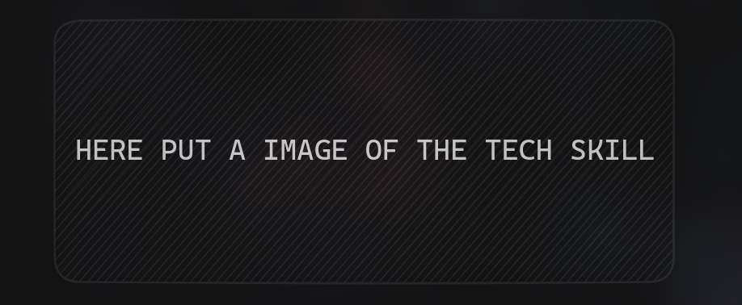
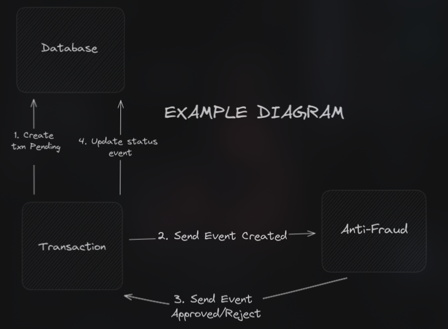

# 🐬 The main proposition of the test

> ⚠️ Here i write the reference of the test [link of the test](#) and say the tech main tech skill that i'll learn.

<p align=center>
 
 
</p>

## Problem

A resume of the problem with some important information and the rules of the test

<p align=center>

</p>

## How to run

<details open>
<summary>
Pre-requisites
</summary> <br />
To be able to start development the application make sure that you have the following pre-requisites installed:

###

- A list of the requisites to run the test
- Bun

  ```bash
  curl -fsSL https://bun.sh/install | bash
  ```

- Docker and Docker Compose installed
- [K6 (optional)](https://k6.io/docs/get-started/installation/)

##

</details>

<details open>
<summary>
Running the app
</summary>

###

1. Clone repository:

   ```bash
   git clone https://github.com/vsantos1711/elysia-transaction-validate.git && cd elysia-transaction-validate
   ```

2. Start the Kafka using Docker Compose:

   ```bash
   docker compose up
   ```

3. Run the `anti-fraud` service:

   ```bash
   cd anti-fraud && bun install && bun run dev
   ```

4. Run the `transaction` service:

   ```bash
   cd transaction && bun install && bun run dev
   ```

   </details>

## API Endpoint

### Create Transaction

- **URL:** `/transaction`
- **Method:** `POST`
- **Request Body:**
  ```json
  {
    "accountExternalIdDebit": "string",
    "accountExternalIdCredit": "string",
    "tranferTypeId": 1,
    "value": 1
  }
  ```

## Run k6 test

```bash
k6 run scripts/k6.js
```
