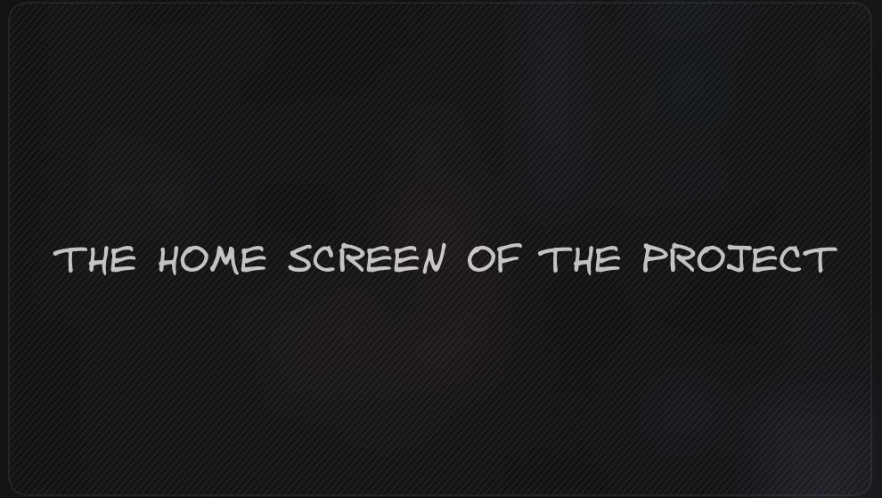

<h1 align="center">🐱 MeowHub</h1>

<p align="center">
  <i align="center">A little short description about the app/ idea 🚀</i>
  
</p>

## Project Status


## Description

MeowHub is a straightforward social media platform for cat lovers! Share delightful cat photos, along with names, ages, and more details about your feline friends. Connect with fellow cat enthusiasts and immerse yourself in the world of cats. It's as simple as a purr! 🐱📸

## Tools

[](https://nextjs.org/)
[](https://www.typescriptlang.org/)
[](https://tailwindcss.com/)
[](https://vercel.com/)
[](https://zod.dev/)
[](https://ui.shadcn.com/)

## Usage

To start using our app, you can begin right away with our hosted version. Visit [link](#Contributing) and navigate to the login page.

## Development

Alternatively to using the hosted version of the product, Application can be ran local for code generation purposes or contributions - if so please refer to our [contributing](#) section.

<details open>
<summary>
Pre-requisites
</summary> <br />
To be able to start development the application make sure that you have the following pre-requisites installed:

###

- A list of the requisites to run the test
- Bun

  ```bash
  curl -fsSL https://bun.sh/install | bash
  ```

- Docker and Docker Compose installed
- [K6 (optional)](https://k6.io/docs/get-started/installation/)

##

</details>

<details open>
<summary>
Running the app
</summary> <br />

To setup a local development environment the following steps can be followed:

###

1. Clone the repository and install dependencies:

```shell
git clone https://github.com/vsantos1711/meow-hub.git && cd meow-hub && pnpm install
```

2. Run the app:

```shell
pnpm install && pnpm run dev
```

</details>

## Contributing

Contributions are welcome! If you want to contribute to the project, follow the instructions below:

- Fork the project.
- Create a branch with your changes: git checkout -b my-feature.
- Commit your changes: git commit -m 'Adding my feature'.
- Push the changes to the remote repository: git push origin my-feature.
- Open a pull request on the original repository.

> For a better commits semantic, we recommend the use of the [Conventional Commits](../COMMITS.md)

## Contributors

<a href="https://github.com/vsantos1711/useful-things/graphs/contributors">
  
</a>

## License

Licensed under the [MIT license](../LICENSE.md).
